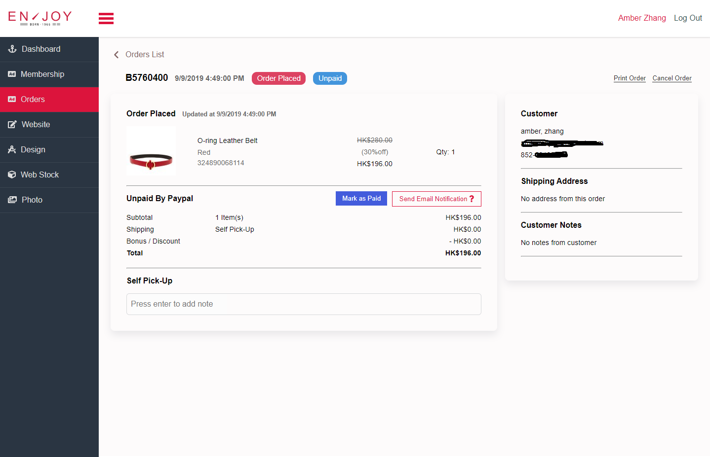

  

  <h3 align="center">Enjoybag Admin Website</h3>

  

    Admin website with Angular 7 + JWT + RESTful services 
     
    This project is currently under active development.   
     
    
  

## Table of contents

- [Table of contents](#table-of-contents)
- [What's included](#whats-included)
- [Sitemap](#sitemap)
- [TODO](#todo)
- [Screenshots](#screenshots)
  
## What's included

- [x] Custom Components
- [x] Defining routes including child routes and lazy loaded routes
- [x] Angular reactive form modules 
- [x] Http client and HTTP Interceptors ( JWT and Error )
- [x] RxJS/Observables
- [x] Third-party api intergration, like Mailchimp email service
  

## Sitemap
  

## TODO

- Get data analysis and integrate with Facebook Pixel
- Complete sales report analysis
- Complete membership management 
- Complete order management
- Integrate with IBM system 成品倉
  
## Screenshots
  
  
  
  

